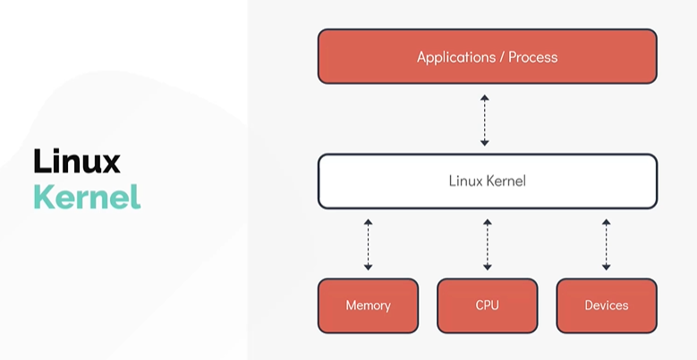
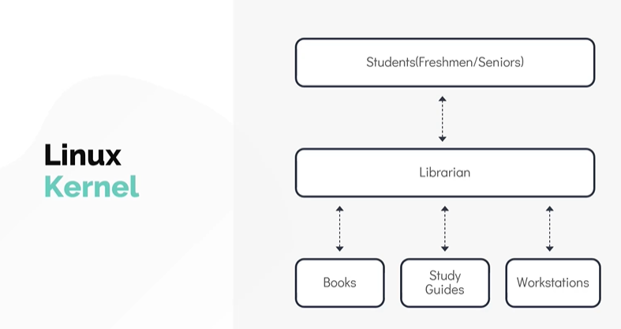
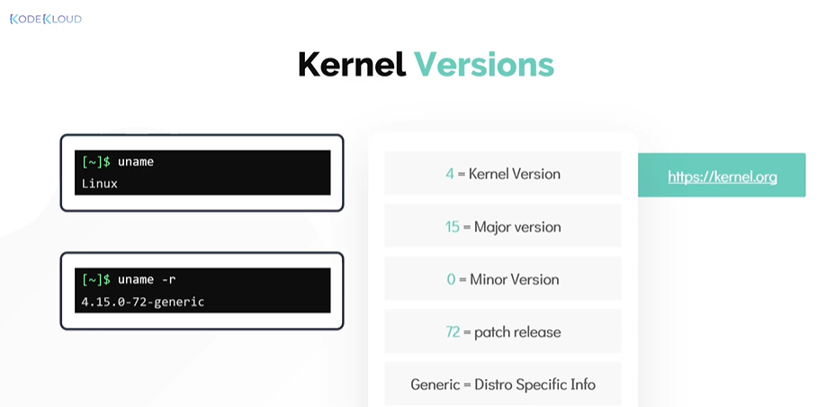

# Linux Core Concepts

In this section, we will take a look at the core concepts of a linux operating system.
- We will start with introduction to the linux kernel.
- We will then learn about the kernel space and user space.

## Linux Kernel

#### If you have worked with any operating system, you have run into the term kernel. 

- The Linux kernel is monolithic, this means that the kernel carrries out CPU scheduling, memory management and several operations by itselfs. 
- The Linux Kernel is also modular, which means it can extends its capabilities through the use of dynamically loaded kernel modules




#### To understand a kernel in simple terms, let us use an analogy of a **`College Library`**. Here the librarian is equal to Linux Kernel.



#### The Kernel is responsible for 4 major tasks

1. Memory Management
1. Process Management
1. Device Drivers
1. System calls and Security

## Linux Kernel Versions

#### let us know identify the ways to identify linux kernel versions

Use **`uname` command to get the information about the kernel (by itself it doesn't provide much information except that the system uses the **`Linux`** Kernel.
```
$ uname
```

Use the **`uname -r`** or **`uname**` comamnd and option to print the kernel version
```
$ uname -r
$ uname -a
```




