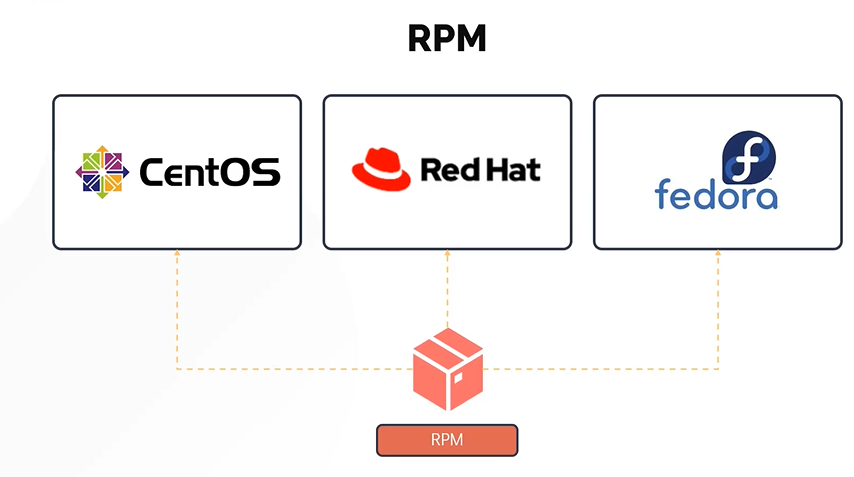
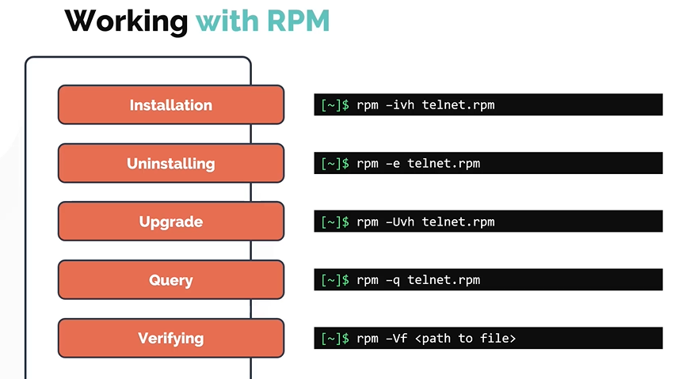
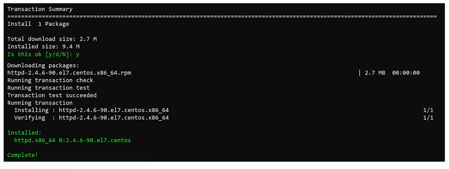

# RPM and YUM Package Managers

In this section, we will take a look at **`RPM`** and **`YUM`** package managers in detail.
- RPM
- YUM

## RPM (Redhat Package Manager)

This package manager is used in RHEL as well as other linux distributions but these re the most common ones. The File extensions for packages manage by RPM is **`.RPM`**



#### Working with RPM

RPM has five basic modes of operations. Each of these modes can be run using **`rpm`** command followed by a specific command **`options`**. Despite of this, RPM doesn't resolve dependencies on its own. This is why we make use of a higher level of package manager called **`YUM`**.
1. Installing
1. Uninstalling
1. Upgrade
1. Query
1. Verfiying

   

## YUM (Yellowdog Updater Modifier)

YUM is a free and opensource package manager.
- Works on RPM based Linux systems
- Works with Software repositories which are essentially a collection of packages and provides package independency management on RPM based distro. The repository information is stored in **`/etc/yum.repos.d/`** and repository files will have the **`.repo`** extension.
- Acts as a high level package manager but under the hood it still depeneds on **`RPM`** to manage packages on the linux systems.
- Unlike RPM, YUM handles package dependencies very well (Automatic Dependency Resolution). It is able to install any dependencies packages to get the base package install on the linux system.

  
  
#### Let us see how YUM installs a package.


#### Now, lets take a look at sequence of steps envolve while installing the package.
- Once yum runs **`yum install`** command is issued YUM first runs transaction check, if the package is not installed in the system yum checks the configured repositories under **`/etc/yum.repos.d/`** for the availability of the requested package. 
- It also checks if there are any dependent packages are already installed in the system or if it needs to be upgrade.

  
  
- After this step, transaction summary is displayed on the screen for the user to review, if we wish to proceed with the install enter the **`y`** button (this step can be skipped by providing the **`-y`** flag with the **`yum install`** command).
- Yum will download and install necessary RPMs to linux system

  
  

If you want to update a single package, use **`yum update`** command. If the package is already in the latest version in the repository and hence no action will be taken


#### Common Commands

To list all the repos added to your system. Run **`yum repolist`**
```
$ yum repolist
```

To check which package should be installed for specific command to work. Use **`yum provides`** command followed by <command> name.
```
$ yum provides scp
```

To Install a package
```
$ yum install httpd
```

To Install a package to automatically answer "yes" to any question prompt during the operation. Use **`-y`** flag with the **`yum install`** command.
```
$ yum install httpd -y
```

To remove a package
```
$ yum remove httpd
```

To update a package
```
$ yum update telnet
```

To update all packages in the system, use the **`yum update`** command without any arguments.
```
$ yum update
```


  


