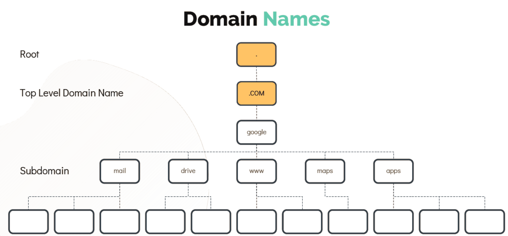
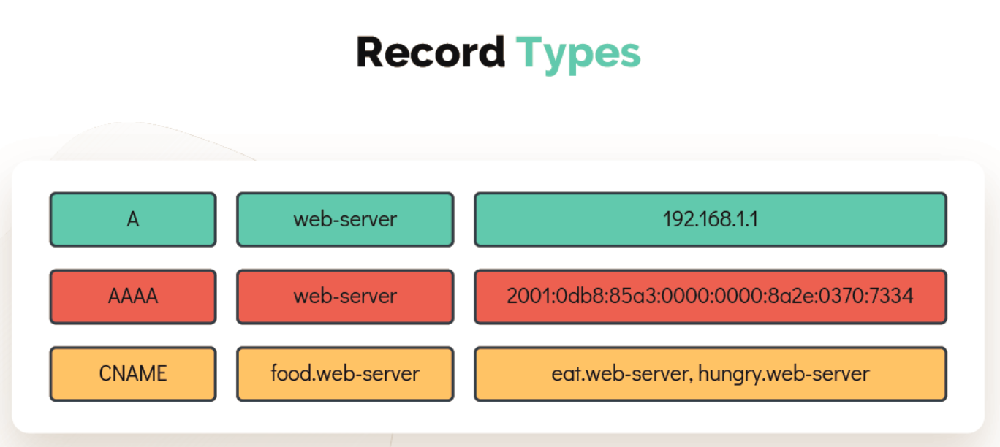

# DNS

  - Take me to the [Tutorial](https://kodekloud.com/courses/873064/lectures/17074529)

  - The domain name system is a distributed way to share these name-to-IP associations instead of requiring each computer to synchronize a hosts file. A name server publishes the IP address for a domain and provides a single location to update when an IP changes.

  
  #### Ping 

  - **`Ping`** Command is use to check the remote machine is reachable or not.

    ```
    [~]$ ping 192.168.1.11
    Reply from 192.168.1.11: bytes=32 time=4ms TTL=117
    Reply from 192.168.1.11: bytes=32 time=4ms TTL=117
    ```

  - To **`Ping`** the remote host with a name instead of **`IP Address`** make an entry in **`/etc/hosts`** file

    ```
    [~]$ cat >> /etc/hosts
    192.168.1.11 db
    ```
    
    ```
    [~]$ ping db
    PING db (192.168.1.11) 56(84) bytes of data.
    64 bytes from db (192.168.1.11): icmp_seq=1 ttl=64 time=0.052 ms
    64 bytes from db (192.168.1.11): icmp_seq=2 ttl=64 time=0.079 ms
    ```
  - You can configure as many hosts you want in the **`/etc/hosts`** file.

    ```
    [~]$ cat >> /etc/hosts
    192.168.1.10 web
    192.168.1.11 db
    192.168.1.12 nfs
    192.168.1.20 web
    192.168.1.21 db-1
    192.168.1.22 nfs-1
    192.168.1.30 web-1
    192.168.1.31 db-2
    192.168.1.32 nfs-2
    192.168.1.40 web-2
    192.168.1.41 sql
    192.168.1.42 web-5
    192.168.1.50 web-test
    192.168.1.61 db-prod
    192.168.1.52 nfs-4
    192.168.1.60 web-3
    192.168.1.61 db-test
    192.168.1.62 nfs-prod
    ```

  - Every host has a DNS resolution file **`/etc/rsolve.conf`**

    ```
    [~]$ cat /etc/resolv.conf
    nameserver 192.168.1.100    
    ```

  - The **`/etc/nsswitch.conf`** file is used to configure which services are to be used to determine information such as hostnames, password files, and group files.There is a specific search order according to which it is performed. This order is set in this configuration file.

    ```
    [~]$ cat /etc/nsswitch.conf
    …
    hosts: files dns
    …
    ```

# DOMAIN NAMES

  

  - .com - Commerical or General Purpose.
  - .net - Network or General Purpose.
  - .edu - Education Purpose
  - .org - Organizations for non profit organizations etc.

  

# RECORD TYPES

  
  
  - A - IP to host names.
  - AAAA - Storing ipv6 to hostnames.
  - CNAME - Mapping one name to another.
  
  - To test the DNS resolution you can use **`nslookup`** command, this will query a hostname from a DNS Server.

  ```
  [~]$ nslookup www.google.com
  Server: 8.8.8.8
  Address: 8.8.8.8#53
  Non-authoritative answer:
  Name: www.google.com
  Address: 172.217.0.132
  ```

  - Another useful tool to query a hostname from a DNS server is **`dig`** which return more detailed information as shown.

  ```
  [~]$ dig www.google.com
  ; <<>> DiG 9.10.3-P4-Ubuntu <<>> www.google.com
  ;; global options: +cmd
  ;; Got answer:
  ;; ->>HEADER<<- opcode: QUERY, status: NOERROR, id: 28065
  ;; flags: qr rd ra; QUERY: 1, ANSWER: 6, AUTHORITY: 0, ADDITIONAL: 1
  ;; OPT PSEUDOSECTION:
  ; EDNS: version: 0, flags:; udp: 512
  ;; QUESTION SECTION:
  ;www.google.com. IN A
  ;; ANSWER SECTION:
  www.google.com. 245 IN A 64.233.177.103
  www.google.com. 245 IN A 64.233.177.105
  www.google.com. 245 IN A 64.233.177.147
  www.google.com. 245 IN A 64.233.177.106
  www.google.com. 245 IN A 64.233.177.104
  www.google.com. 245 IN A 64.233.177.99
  ;; Query time: 5 msec
  ;; SERVER: 8.8.8.8#53(8.8.8.8)
  ;; WHEN: Sun Mar 24 04:34:33 UTC 2019
  ;; MSG SIZE rcvd: 139
  ```

# HANDS-ON LABS
  
  - Lets have some fun and challenging [excerises](https://kodekloud.com/courses/873064/lectures/17074530)